# PP1 - HTML/CSS Essentials - JBs Digital Consultancy

JB's Digital Consultancy is a site aimed at promoting digital marketing and website development services. It's purpose is to provide users information on the types of services the agency can provide to help them generate more enquires and sales. It is a way to promote my digital services and generate online enquires through form fills. JB's Digital Consultancy is targeted at small businesses that need help with their marketing/online presence. 

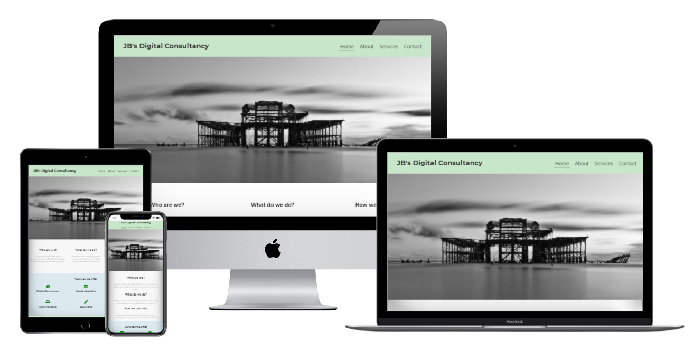

## Live Site

[JB's Digital Consultancy](https://jbachtiger.github.io/ci-pp1-jbs-digital-consultancy/)

## Repository
[https://github.com/Jbachtiger/ci-pp1-jbs-digital-consultancy](https://github.com/Jbachtiger/ci-pp1-jbs-digital-consultancy)

## Features 

In this section, you should go over the different parts of your project, and describe each in a sentence or so. You will need to explain what value each of the features provides for the user, focusing on who this website is for, what it is that they want to achieve and how your project is the best way to help them achieve these things.

### Existing Features

- __Navigation Bar__

  - The navigation bar is featured on all four pages, is responsive and including links to the Logo, Homepage, About, Services and Contact pages. It is identical in each page to ensure easy navigation and a good user experience. 
  - The purpose of this section is to allow the user to navigate the pages easily across all devices without having to use a back button to get to the next page.

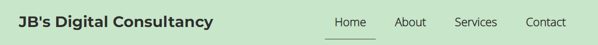

- __Hero Images__

  - Each page includes a hero image at the top of it that is relevant to that section. The homepage and about pages have images related to Brighton which is where the agency is based. Where as the services and contact page have images that can be associated with those topics more. 

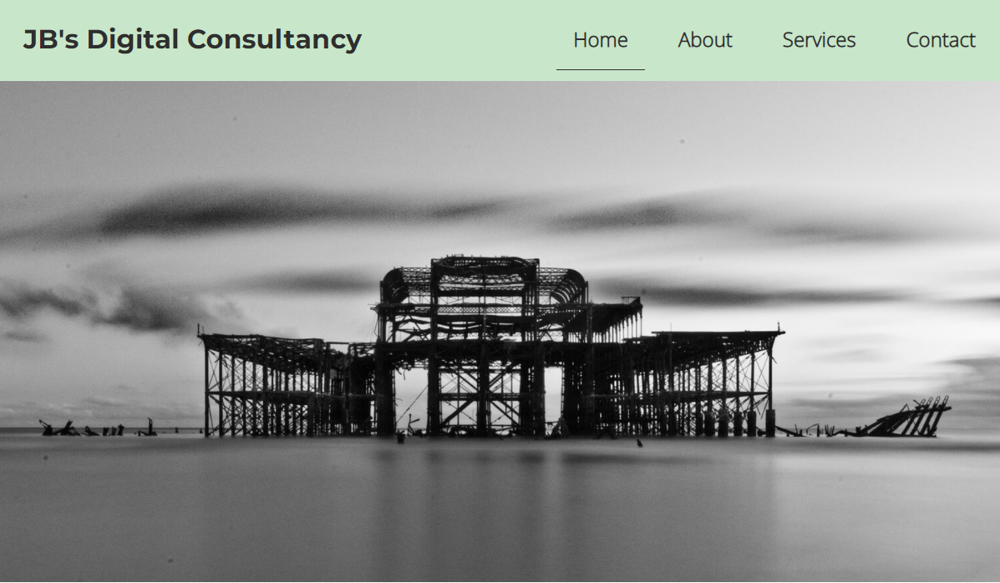

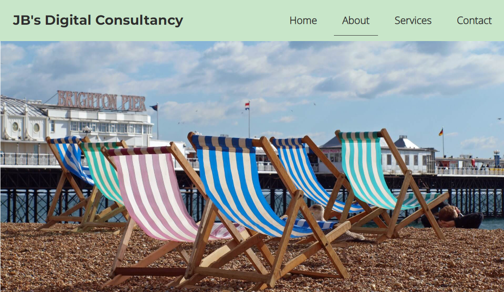

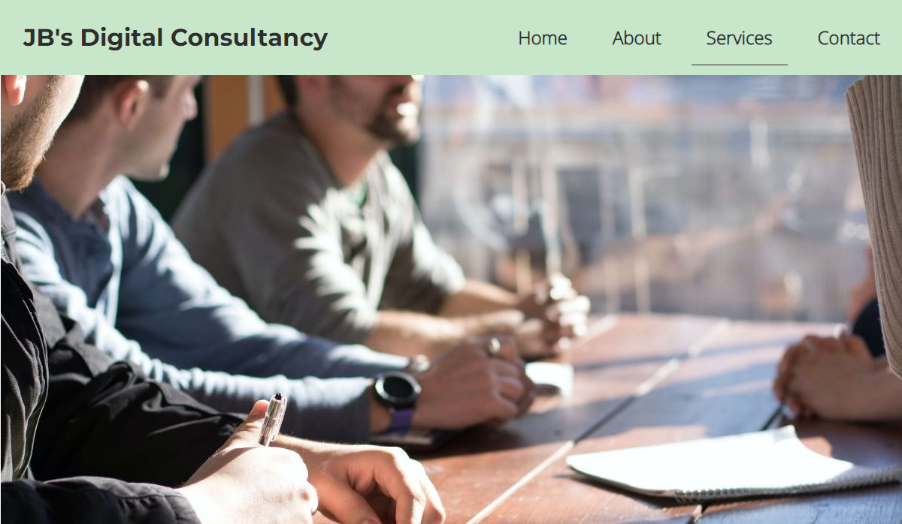

- __Introduction Section__

  - The introduction section is one of the first pieces of content you see. This provides a quick overview of who we are, what we do and how our services can help the potential user.  
  - The user will be able to make a quick decision based on this whether the outcomes align with their objectives and if they wish to investigate further.

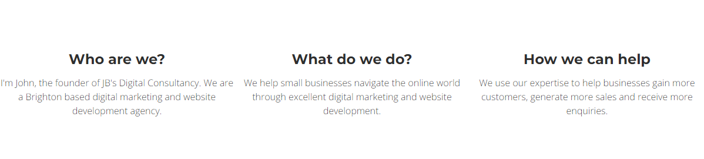

- __Services We Offer Section__

  - This section will allow the user to see exactly  what services the business offers and if there is anything that may align with their needs.
  - It is accompanied with logos for each service that represents that service meaning the user does not have to read the text if they don't wish to in order to still get a good grasp of the service.

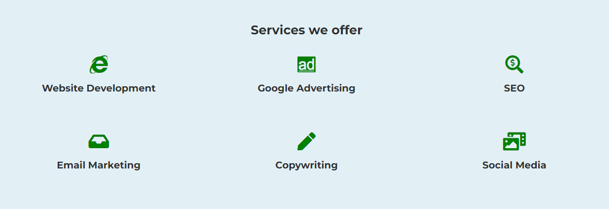

- __The Footer__ 

  - The footer section includes links to the relevant social media sites for JB's Digital Consultancy. The links all open to a new tab to allow easy navigation for the user. They also have a hover effect added to them to make it more obvious that they are clickable.
  - The footer a good way to encourage users to connect via social media and spread the word about the business.

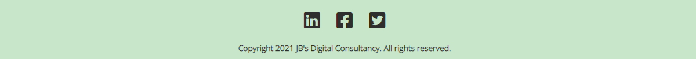

- __About__

  - The about page will provide the user with a more detailed overview of the business and myself (the owner). This will give users a better understanding of the agencies experience, the motivations behind it and how working with us can help them. 
  - This section builds upon the intro section and provides more in-depth content about the agency to reinforce what has already been said on the homepage.  
  - A circular image of my face has also been added to this page to put a face to a name and build trust with the user. The image has been animated to make it more eye catching.

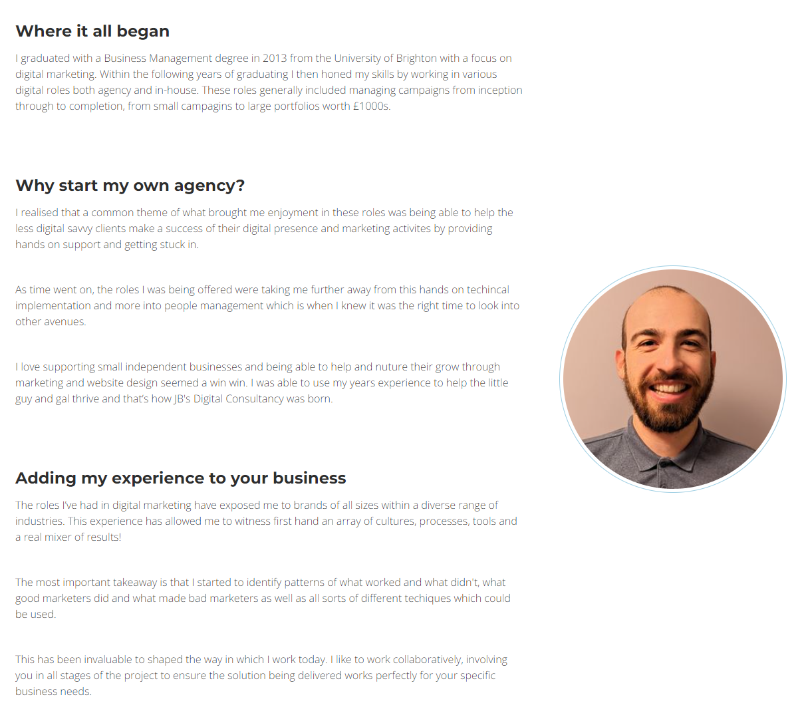

- __Services__

  - This page will provide a short summary of each of the services we offer accompanied with a call to action button which guides them to fill out a form. 
  - Images have also been used to make the page more attractive and convey the message across throguh words as well as visually.
  - The main purpose of the buttons is for lead generation and the colour orange was chosen as this colour is proven to help increase click through rates.

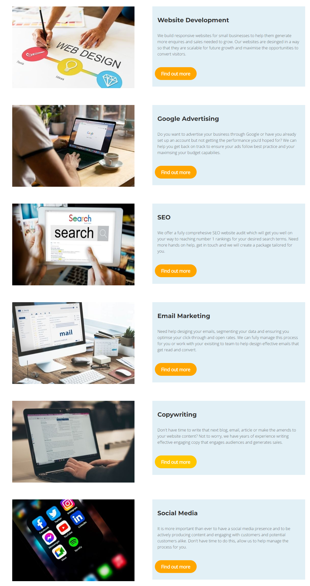

- __Contact__

  - This page is where the form sits. It has six fields that need inputting of which some are required and others not. The user will be able to click on this page to make an enquiry and discuss the services offered in more detail. They can choose which service they are interested in or if they wish to discuss all of them. 
  - The form has box shadowing on it and a black border on the input fields to make it stand out.
  - The button is orange and has an opacity on it to provide a visual queue to the user when they click on it. 

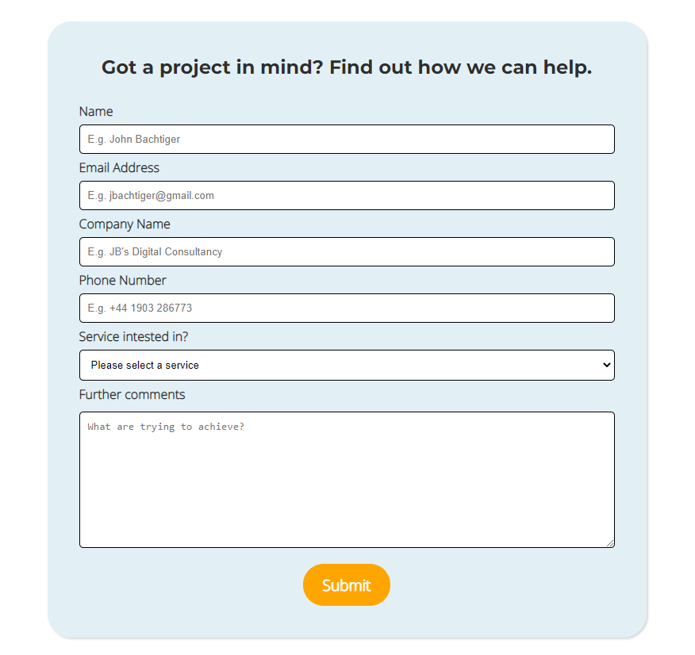

### Future Development

- Add a portfolio page to display testimonials and case studies.
- Add a blog page to be able to ensure the website get's consistent fresh long form content that is industry relevant and targeted to specific keywords that will help the websites SEO and gain more organic visitors.
- Make use of videos for the service page, discussing what each service is in more detail.
- Create a burger menu for mobile view - this will especially be needed when more pages are added to the menu.
- Currently the form on the contact page uses the Code Institute form dump url as I have not yet learned how to create the script needed in order to make the form function correctly without it.
- Create an email newsletter signup form.

## Testing 

The main focus of the testing is on HTML and CSS as these are the two languages that were used to create the static website. The testing carried out ensures that the functionality and visual aspects of the website all work as intended. Testing will be done using numerous devices and browsers, ensuring all UX is up to scratch as well as testing the websites accessibility, SEO and validation. I have checked the following:

- The overall website navigational experience, ensuring each page is easy to access and there is a clear and logical flow.
- All internal, outgoing and anchor elements work correctly. External links open up in a new tab.
- All forms are working as expected including script checks e.g. if a user fills in a mandatory field in a form an error message is shown, default values are being populated, optimally formatted for better readability and form is correctly linked to Code Institute form dump on submit.
- Contrast checks should report no errors.
- Validation checks for HTML and CSS should report no errors. 
- Lighthouse test scores should be high (above 90).

I have tested the website across the three major browsers - Goolge, Firefox and Microsoft Edge. For each browser, functionality was tested including links and the responsive design. The website performed as intended and the responsive design was checked using developer tools across multiple devices with structural integrity holding for the various sizes. 

The official W3C Markup Validator was used to validate both the html and css of the project to ensure there were no syntax errors within the site. The links to the results for each html page and css stylesheet is below.

1. W3C HTML Markup Validator

- [index.html](https://validator.w3.org/nu/?showsource=yes&doc=https%3A%2F%2Fjbachtiger.github.io%2Fci-pp1-jbs-digital-consultancy%2Findex.html)
- [about.html](https://validator.w3.org/nu/?showsource=yes&doc=https%3A%2F%2Fjbachtiger.github.io%2Fci-pp1-jbs-digital-consultancy%2Fabout.html)
- [services.html](https://validator.w3.org/nu/?showsource=yes&doc=https%3A%2F%2Fjbachtiger.github.io%2Fci-pp1-jbs-digital-consultancy%2Fservices.html)
- [contact.html](https://validator.w3.org/nu/?showsource=yes&doc=https%3A%2F%2Fjbachtiger.github.io%2Fci-pp1-jbs-digital-consultancy%2Fcontact.html)

2. W3C CSS Markup Validator
[https://jigsaw.w3.org/css-validator/validator](https://jigsaw.w3.org/css-validator/validator)

### CSS Validator Results

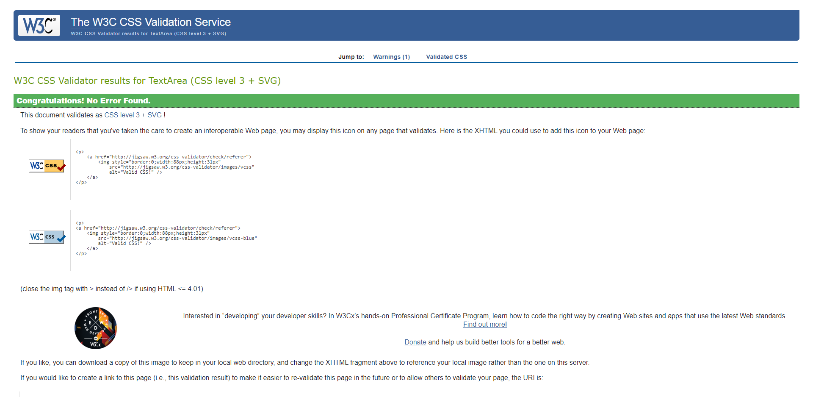

I have checked the websites color contrast using two tools. The first being WebAim providing information the right colour combinations for foreground and background colours to ensure a good contrast ratio. Secondly, I checked the websites colour contrast using a Color Contrast Accessibility Validator by a11y. The results are shown below.

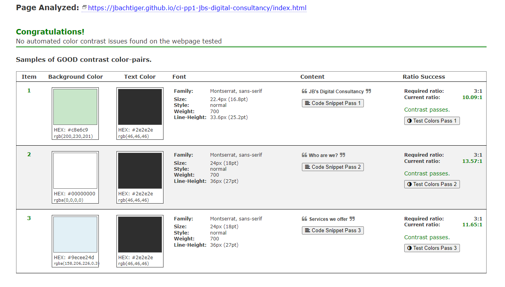

I have used Chromes Lighthouse tool to run a test and audit the entire website. The results are shown below.

- Desktop  
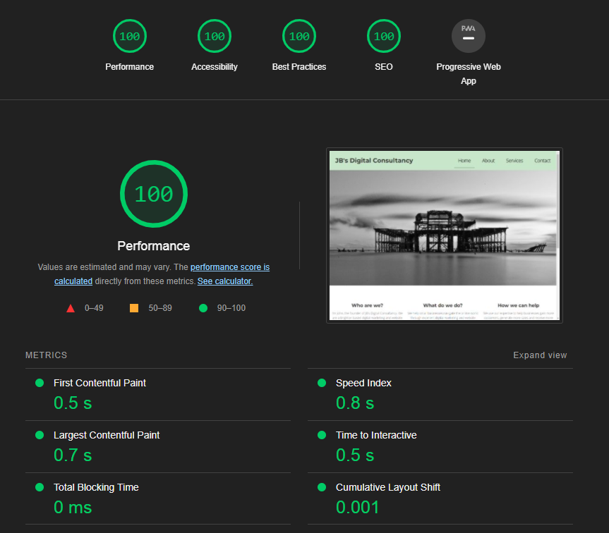

- Mobile  
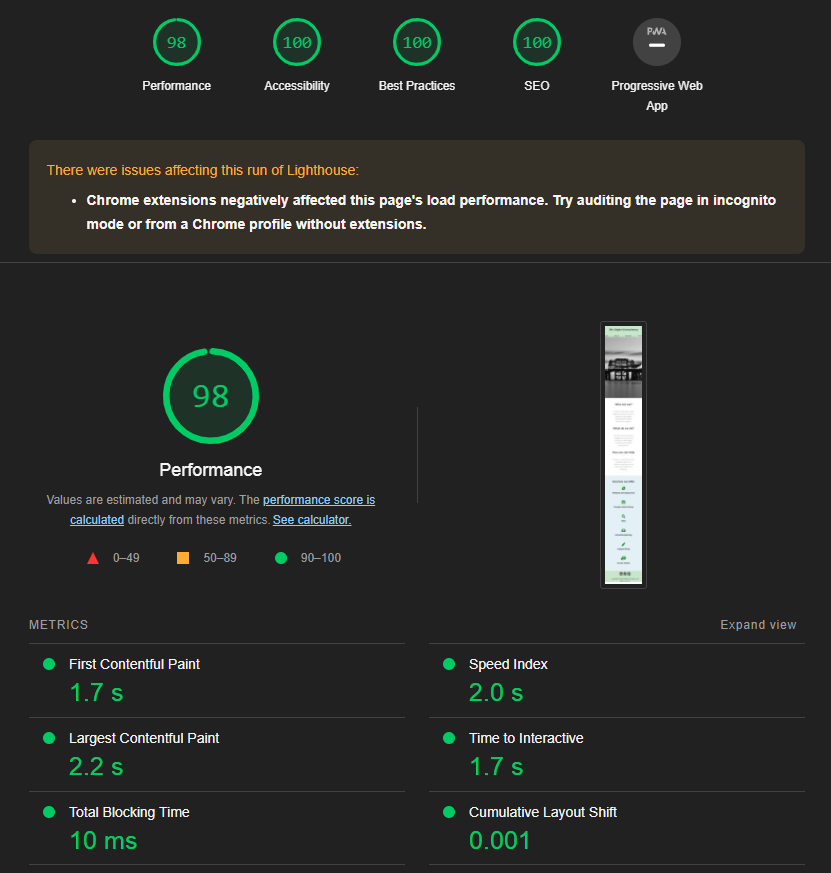

### Solved Bugs

### Known Bugs

There are no known bugs left in this project.

## Deployment

This site was deployed to Github pages by following these steps:

1. Login/Signup to Github.
2. Navigate to relevant Github repository [here](https://github.com/Jbachtiger/ci-pp1-jbs-digital-consultancy).
3. Click on the Settings tab, on the navigation menu under the repository name.
4. Scroll down the menu to the second to last item named "Pages" and click into it.
5. Under source, choose which branch to deploy. For our purposes choose main branch.
6. Choose the folder to deploy from, in this case /(root).
7. Click "Save" and wait for website to deploy. This can take a couple minutes.
8. Your URL will be display above "Source".

## Credits 

### Code
1. [Google Fonts](https://fonts.google.com/) - used to import fonts to website.
2. [Button Optimizer](https://buttonoptimizer.com/) - a button generator tool.
3. [W3Schools](https://www.w3schools.com/howto/howto_css_three_columns.asp) - utlilsed code to create three columns.
4. [Love Running Project](https://github.com/Jbachtiger/love-running/blob/main/assets/css/style.css) - used base code for the circle container and zoom effect code.
5. [CSS Scan](https://getcssscan.com/css-box-shadow-examples) - used code to create a box shadow.
6. [Font Awesome](https://fontawesome.com/) - Library of icons used for social media and services we offer.
7. [TinyPNG](https://tinypng.com/) - used to compress images.

### Media
1. All stock images are royalty free and taken from the following sites: [Unsplash](https://unsplash.com/) and [Raw Pixel](https://www.rawpixel.com/).
2. Image on about page is a personal profile picture taken by myself.

### Acknowledgments 