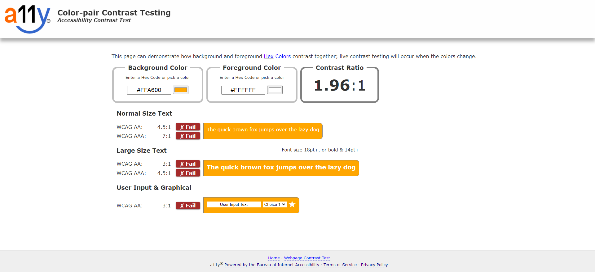
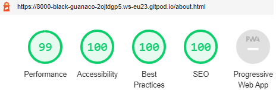

# PP1 - HTML/CSS Essentials - JBs Digital Consultancy

JB's Digital Consultancy is a site aimed at promoting digital marketing and website development services. It's purpose is to provide users information on the types of services the agency can provide to help them generate more enquires and sales. It is a way to promote my digital services and generate online enquires through form fills. JB's Digital Consultancy is targeted at small businesses that need help with their marketing/online presence. 

## Live Site

[JB's Digital Consultancy](https://jbachtiger.github.io/ci-pp1-jbs-digital-consultancy/)

## Repository
[https://github.com/Jbachtiger/ci-pp1-jbs-digital-consultancy](https://github.com/Jbachtiger/ci-pp1-jbs-digital-consultancy)

## Table of Contents
- [User Experience (UX)](#user-experience)
  - [User Stories](#user-stories)

- [Design](#design)
  - [Colour Scheme](#colour-scheme)
  - [Typography](#typography)
  - [Wireframes](#wireframes)

- [Features](#features)
  - [Future Development](#future-development)

- [Technologies Used](#technologies-used)
  - [Languages Used](#languages-used)
  - [Frameworks, Libaries and Programs Used](#frameworks-libaries-and-programs-used)

- [Testing](#testing)
  - [Browser and Device Testing](#browser-and-device-testing)
  - [W3C Validator](#w3c-validator)
  - [Colour Contrast Checks](#colour-contrast-checks)
  - [Lighthouse Tool](#lighthouse-tool)
  - [Solved Bugs](#solved-bugs)
  - [Known Bugs](#known-bugs)

- [Deployment](#deployment)

- [Credits](#credits)
  - [Code](#code)
  - [Media](#media)
  - [Acknowledgments](#acknowledgments)

## User Experience
### User Stories
__Business Owner Goals__
- As a site owner I want to create a clean looking, professional, well structured website that generates leads.
- As a site owner I want to create a website that is informative regarding the services the agency offers.
- As a site owner I want to make it as easy as possible to navigate the website and allow a user to fill out a contact form.    
      
__First Time Visitor Goals__
- I want to find out what services the company offers.
- I want to find out a bit of background about the company.
- I want to know why I should use this companies services.

 __Returning Visitors__
- As a returning visitor I want to be able to find exactly what i'm looking for quickly.
- As a returning visitor I want to be able to get in contact quickly and easily.
- As a returning visitor I want to be able to access the companies social media activity to get a feel of what the brands about.

## Design
### Colour Scheme
- The colour scheme has been carefully chosen to ensure accessability for all.
- The colours compliment each other to ensure a good contrast ratio.
- The colours used provide a professional and classy look to the website. 
- The colour organge was used for CTA buttons to ensure they stand out.
- The main colours used on the website are green, blue, white and orange inlcuding varying shades.
- Hex codes for colours: #C8E6C9 (Green), #9ECEE2 (Blue), #2E2E2E (Dark Shade of Grey) and #FFA500 (Orange).

### Typography
- The website has imported Montserrat Bold and Open Sans Light fonts into the CSS file from Google Fonts.
- Montserrat bold has been chosen as the main font for all headings. This is becuase it provides good visual seperation between paragraph text and titles whilst always providing great legibility.
- Open Sans Light has been used for the paragraph text becuase it is easy to read. 
- The fallback family font is san-serif for both of these in cases where these fonts have difficulty loading. 

### Wireframes
- [Homepage](docs/wireframes/wireframe-homepage.png)
- [About](docs/wireframes/wireframe-about.png)
- [Services](docs/wireframes/wireframe-services.png)
- [Contact](docs/wireframes/wireframe-contact.png)

## Features 

- __Navigation Bar__

  - The navigation bar is featured on all four pages, is responsive and includes links to the Logo, Homepage, About, Services and Contact pages. It is identical on each page to ensure easy navigation and a good user experience. 
  - The purpose of this section is to allow the user to navigate the pages easily across all devices without having to use a back button to get to the next page.

- __Hero Images__

  - Three pages have a hero image at the top of them that is relevant to that section. These pages include Home, About and Services. 
  - The homepage and about pages have images related to Brighton which is where the agency is based. Where as the services page has an image that can be associated with the topic.
  - The contact page has purposely not been given a hero image to ensure the form is the first thing a user sees and therefore, maximising the chance of them filling it out.
  - The hero images introduces the user to each section in a visually appealing way and gives the user further insights into the page they are just landing on. E.g. Brighton Pier shows that the agency is located in Brighton. 

- __Introduction Section__

  - The introduction section is one of the first pieces of content you see. This provides a quick overview of who we are, what we do and how our services can help the potential user.  
  - The user will be able to make a quick decision based on this whether the outcomes align with their objectives and if they wish to investigate further.

- __Services We Offer Section__

  - This section will allow the user to see exactly what services the business offers and if there is anything that may align with their needs.
  - It is accompanied with logos for each service that represents that service meaning the user does not have to read the text if they don't wish to in order to still get a good grasp of the services. 

- __The Footer__ 

  - The footer section includes links to the relevant social media sites for JB's Digital Consultancy. The links all open to a new tab to allow easy navigation for the user. They also have a hover effect added to them to make it more obvious that they are clickable.
  - The footer is a good way to encourage users to connect via social media and spread the word about the business.

- __About__

  - The about page will provide the user with a more detailed overview of the business and myself (the owner). This will give users a better understanding of the agencies experience, the motivations behind it and how working with us can help them. 
  - This section builds upon the intro section and provides more in-depth content about the agency to reinforce what has already been said on the homepage.  
  - A circular image of my face has also been added to this page to put a face to a name and build trust with the user. The image has been animated to make it more eye catching.

- __Services__

  - This page will provide a short summary of each of the services we offer accompanied with a call to action button which guides them to fill out a form. 
  - Images have also been used to make the page more attractive and convey the message through words as well as visually.
  - The main purpose of the buttons is for lead generation and the colour orange was chosen as this colour is proven to help increase click through rates.

- __Contact__

  - This page is where the form sits. It has six fields that need inputting of which some are required and others not. 
  - The user will be able to click on this page to make an enquiry and discuss the services offered in more detail. They can choose which service they are interested in or if they wish to discuss all of them. 
  - The form has box shadowing on it and a black border on the input fields to make it stand out.
  - The button is orange and has an opacity on it to provide a visual aid to the user when they click on it. 

### Future Development

- Add a portfolio page to display testimonials and case studies.
- Add a blog page to be able to ensure the website get's consistent fresh long form content that is industry relevant and targeted to specific keywords that will help the websites SEO and gain more organic visitors.
- Make use of videos for the service page, discussing what each service is in more detail.
- Create a burger menu for mobile view - this will be especially be needed when more pages are added to the navigation. 
- Currently the form on the contact page uses the Code Institute form dump url as I have not yet learned how to create the script needed in order to make the form function correctly without it.
- Create an email newsletter signup form.

## Technologies Used

### Languages Used
- [HTML5](https://developer.mozilla.org/en-US/docs/Glossary/HTML5)

- [CSS3](https://developer.mozilla.org/en-US/docs/Web/CSS)

### Frameworks, Libaries and Programs Used
- [Google Fonts](https://fonts.google.com/) - used to import fonts to website.
- [Font Awesome](https://fontawesome.com/) - library of icons used for social media and services we offer.
- [TinyPNG](https://tinypng.com/) - used to compress images.
- [Canva](https://www.canva.com/) - used to edit and resize images.
- [Gitpod](https://gitpod.io/projects) - this was my code editor for this project.
- [Git](https://git-scm.com/) - was used for version control using the terminal through gitpod to commit to Git and push to Github.
- [Github](https://github.com/) - is used to store the code for this project after being pushed from Git.
- [Balsamiq](https://balsamiq.com/) - was used to create the wireframes during the design process.
- [GoogleDev Tools](https://developer.chrome.com/docs/devtools/) - was used to help investigate issues with code and visually see what code was related to which area on the page.
- [Techsini](http://techsini.com/multi-mockup/index.php) - was used to generate multi-device website mockups.
- [ColorSpace](https://mycolor.space/?hex=%23C8E6C9&sub=1) - used to generate colour pallets for use on website.
- [a11y](https://color.a11y.com/) - used to check website colour contrast and accessibility.
- [WebAIM](https://webaim.org/resources/contrastchecker/) - used to check foreground and background contrast.
- [Fireshot](https://chrome.google.com/webstore/detail/take-webpage-screenshots/mcbpblocgmgfnpjjppndjkmgjaogfceg?hl=en) - this was a Google chrome extension used to take screenshots.

## Testing 

- The main focus of the testing is on HTML and CSS as these are the two languages that were used to create the static website. 
- The testing carried out ensures that the functionality and visual aspects of the website all work as intended. 
- Testing will be done using numerous devices and browsers, ensuring all UX is up to scratch as well as testing the websites accessibility, SEO and validation. 
- I have checked the following:

  - The overall website navigational experience, ensuring each page is easy to access and there is a clear and logical flow.
  - All internal, outgoing and anchor elements work correctly. External links open up in a new tab.
  - All forms are working as expected including script checks e.g. if a user fills in a mandatory field in a form an error message is shown, default values are being populated, optimally formatted for better readability and form is correctly linked to Code Institute form dump on submit.
  - Contrast checks should report no errors.
  - Validation checks for HTML and CSS should report no errors. 
  - Lighthouse test scores should be high (within 90-100 range).

### Browser and Device Testing
__Browsers__

- I have tested the website across the four major browsers including Goolge Chrome, Firefox, Microsoft Edge and Safari. 
- For each browser, functionality was tested including links and the responsive design. 
- The website performed as intended and the responsive design was checked using developer tools across multiple devices with structural integrity holding for the various sizes. 

__Devices Tested__
The website was viewed on a variety of devices of all sizes including:
- Windows 8.1 Desktop (screen resoultions tested in 2560x1080 and 1920x1080)
- Macbook Pro (13 inch 2015 version)
- Moto G4
- Galaxy S5
- Pixel 2
- Pixel 2 XL
- Iphone 5/SE
- Iphone 6/7/8
- Iphone 6/7/8 Plus
- Iphone X
- Ipad
- Ipad Pro
- Surface Duo
- Galaxy Fold
- Nest Hub
- Nest Hub Max

A large amount of testing was done to ensure all pages displayed correctly, buttons worked and forms submitted. Family members and the Code Institute Slack community was asked to review the website to point out any bugs or user experience issues.

### W3C Validator

The official W3C Markup Validator was used to validate both the html and css of the project to ensure there were no syntax errors within the site. The links to the results for each html page and css stylesheet is below.

1. W3C HTML Markup Validator

- [index.html](https://validator.w3.org/nu/?showsource=yes&doc=https%3A%2F%2Fjbachtiger.github.io%2Fci-pp1-jbs-digital-consultancy%2Findex.html)
- [about.html](https://validator.w3.org/nu/?showsource=yes&doc=https%3A%2F%2Fjbachtiger.github.io%2Fci-pp1-jbs-digital-consultancy%2Fabout.html)
- [services.html](https://validator.w3.org/nu/?showsource=yes&doc=https%3A%2F%2Fjbachtiger.github.io%2Fci-pp1-jbs-digital-consultancy%2Fservices.html)
- [contact.html](https://validator.w3.org/nu/?showsource=yes&doc=https%3A%2F%2Fjbachtiger.github.io%2Fci-pp1-jbs-digital-consultancy%2Fcontact.html)

2. W3C CSS Markup Validator - 
[https://jigsaw.w3.org/css-validator/validator](https://jigsaw.w3.org/css-validator/#validate_by_input+with_options)

Result

### Colour Contrast Checks

I have checked the websites color contrast using two tools. The first being WebAim providing information for the right colour combinations for foreground and background colours to ensure a good contrast ratio. Secondly, I checked the websites colour contrast using a Color Contrast Accessibility Validator by a11y. The results are shown below.

All the pages passed the colour contrast analysis except for the button element on the services and contact pages. Below are the results for the failed tests for both pages.

Here is a more detailed report of why the button failed the analysis.

To ensure maximium accessibility, I decided to change the button text colour from white to black to increase the contrast. This fixed the issue and put the ratio well into an acceptable range. See results below for both pages.

Here is a more detailed report of the passed button colour.

### Lighthouse Tool

I have used the Chrome Lighthouse tool to run a test and audit the entire website. The results are shown below.

- index.html
  - Desktop  

  - Mobile  

- about.html
  - Desktop

  
  
  - Mobile 

  

- services.html
  - Desktop

  
  
  - Mobile 

  

- contact.html
  - Desktop

  
  
  - Mobile 

  

All pages have recieved a score above 90 on all 4 categories of performance, accessibility, best practice and SEO showing it is well optimised. 

### Solved Bugs
1. The contact form wasn't submiting when the submit button was clicked. After further investigation the type input was set to the wrong value of text rather than email. 
   - [Link to commit](https://github.com/Jbachtiger/ci-pp1-jbs-digital-consultancy/commit/b1c914e7407c08f26b091b4560dff39ed86c5eec)

2. The contact form was returning an error when submit was clicked. This was because it wasn't linked to any backend for data to be sent to. This was fix by adding the Code Institute form dump url to the action. 
   - [Link to commit](https://github.com/Jbachtiger/ci-pp1-jbs-digital-consultancy/commit/ba8ccb3b7736ab00dbd3af64e624d5a7b7cdc7a6)

3. The Google Chrome Lighthouse tools flagged up that the order of some H tags were wrong on the contact page. The decision was made to merge the content of the h2 and h3 tag into one h2 tag which resolved the issue.
   - [Link to commit](https://github.com/Jbachtiger/ci-pp1-jbs-digital-consultancy/commit/d34a5f07a35c94974fed5b7867e8818226345106)

4. The spacing on the homepage intro section didn't look clean and was too cramped together. The padding and margin was reworked which created a much more visually pleasing intro section.
   - [Link to commit](https://github.com/Jbachtiger/ci-pp1-jbs-digital-consultancy/commit/851294412e4c53626fb42652046ab68788a65945)

5. The hero images didn't look visually pleasing on screen sizes above 1200px. This was due to adding a max-width which once removed fixed the layout issue.
   - [Link to commit](https://github.com/Jbachtiger/ci-pp1-jbs-digital-consultancy/commit/018e47e32b6f9517352f52809839fd57e31665ce)

### Known Bugs

There are no known bugs left in this project.

## Deployment

This site was deployed to Github pages by following these steps:

1. Login/Signup to Github.
2. Navigate to relevant Github repository [here](https://github.com/Jbachtiger/ci-pp1-jbs-digital-consultancy).
3. Click on the Settings tab, on the navigation menu under the repository name.
4. Scroll down the menu to the second to last item named "Pages" and click into it.
5. Under source, choose which branch to deploy. For our purposes choose main branch.
6. Choose the folder to deploy from, in this case /(root).
7. Click "Save" and wait for website to deploy. This can take a couple minutes.
8. Your URL will be display above "Source".

## Credits 

### Code
1. [Button Optimizer](https://buttonoptimizer.com/) - a button generator tool.
2. [W3Schools](https://www.w3schools.com/howto/howto_css_three_columns.asp) - utlilsed code to create three columns on homepage.
3. [Love Running Project](https://github.com/Jbachtiger/love-running/blob/main/assets/css/style.css) - used base code for the circle container and zoom effect code on the about page.
4. [CSS Scan](https://getcssscan.com/css-box-shadow-examples) - used code to create a box shadow for the form on the contact page.
5. [Font Awesome](https://fontawesome.com/) - used code to implement icons on homepage. 

### Media
1. All stock images are royalty free and taken from the following sites: [Unsplash](https://unsplash.com/) and [Raw Pixel](https://www.rawpixel.com/).
2. Image on about page is a personal profile picture taken by myself.

### Resources
1. [CSS Tricks](https://css-tricks.com/snippets/css/a-guide-to-flexbox/) - used to help get a greater understanding of css concepts in particular flexbox.
2. [StackOverflow](https://stackoverflow.com/) - used to expand knowledge of HTML and CSS as well as see how developers were approaching different problems and the types of solutions that could be implemented. 

### Acknowledgments
 - My mentor for their support, advice and patience when reviewing this project with me.
 -  The Code Institute slack community for always being on hand to ask questions and pointing me in the right direction. 